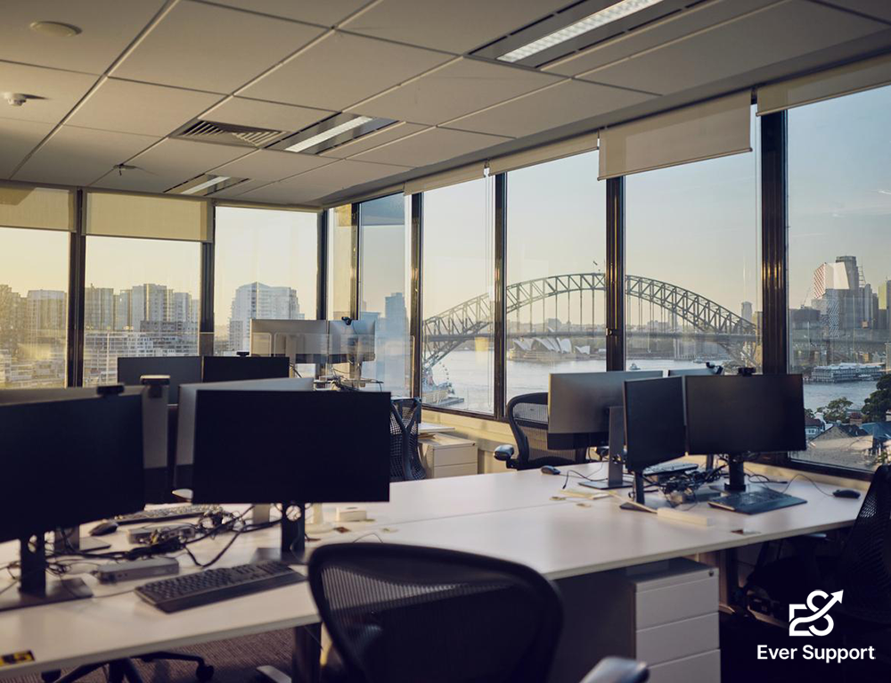

# Tailwind Learning Project

My first project built with **React**, **Vite**, and **Tailwind CSS**.

This project was created as part of my journey to learn modern frontend development and utility-first styling with Tailwind CSS. The main goal was to practice building responsive layouts, improving UI design, and understanding how Tailwind classes can be used to create attractive interfaces efficiently.

## 🚀 Live Demo

https://maedehskh80.github.io/TailwindLearningProject/

## 🛠️ Technologies Used

* React
* Vite
* Tailwind CSS
* JavaScript (ES6+)

## ✨ Features

* Responsive design for desktop and mobile devices
* Modern card-based UI
* Smooth hover animations
* Gradient background
* Clean and readable layout
* External portfolio link integration

## 🎯 What I Learned

Through this project, I practiced:

* Creating responsive layouts with Tailwind CSS
* Working with utility-first CSS classes
* Using Flexbox for layout design
* Importing and managing assets in React
* Deploying React applications to GitHub Pages
* Improving user interface and user experience (UI/UX)

## 📸 Preview

## 🔗 Portfolio

You can find more of my projects and work here:

https://itsmaedehskh.ir

## 👩‍💻 Author

**Maedeh Sadat Khorasani**

* Portfolio: https://itsmaedehskh.ir
* GitHub: https://github.com/MaedehSKh80
* LinkedIn: https://linkedin.com/in/maedehsadatkhorasani/

---

This project represents one of my first steps into modern frontend development and Tailwind CSS. While simple, it reflects my commitment to continuous learning and improving my development skills.
